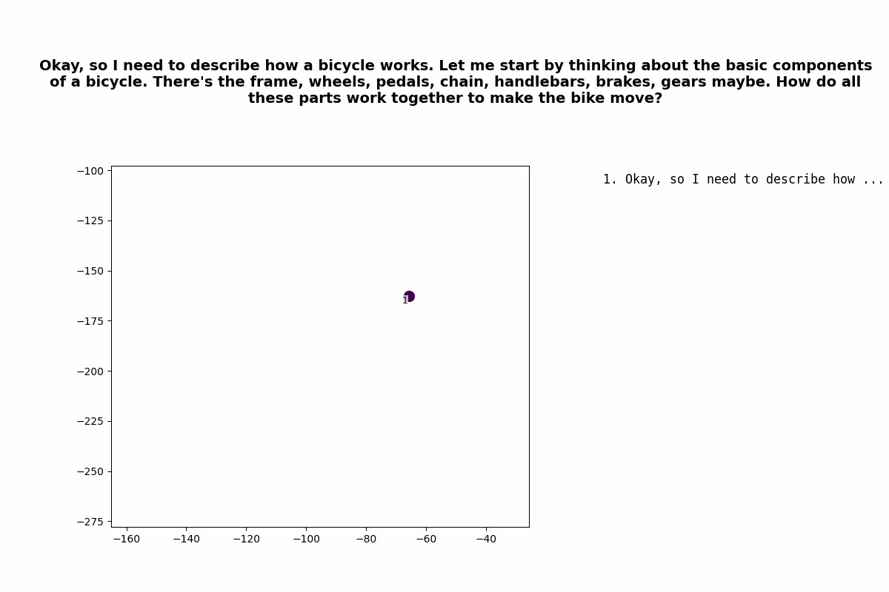
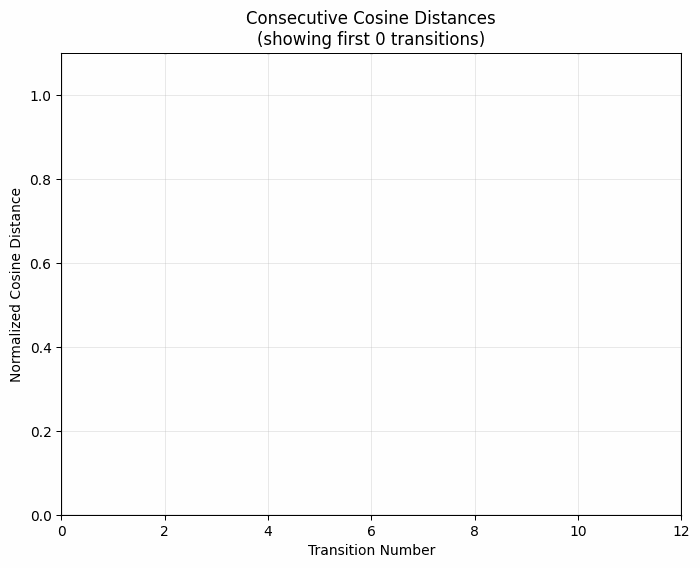
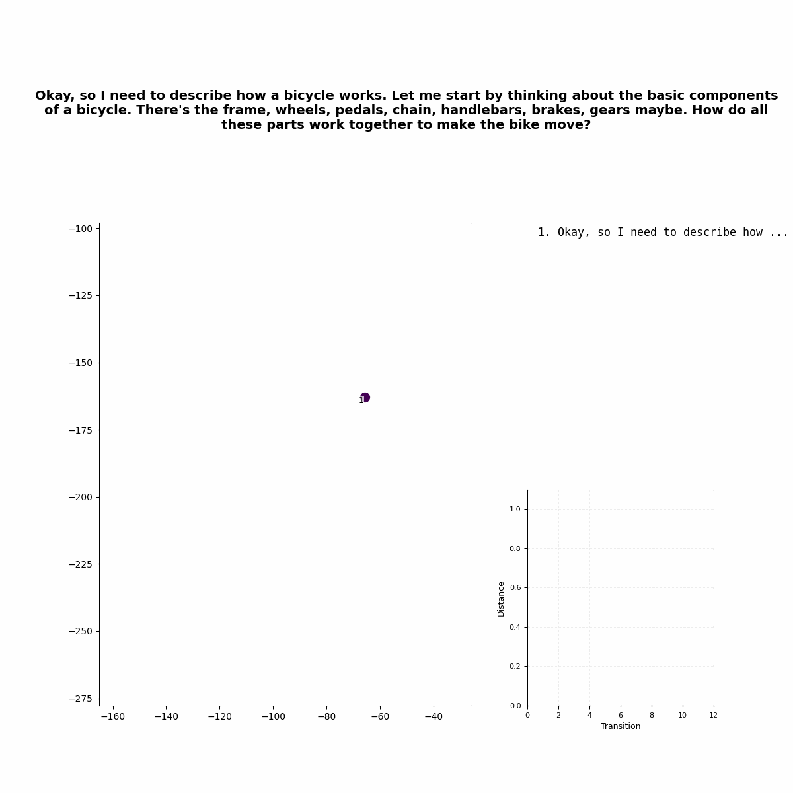
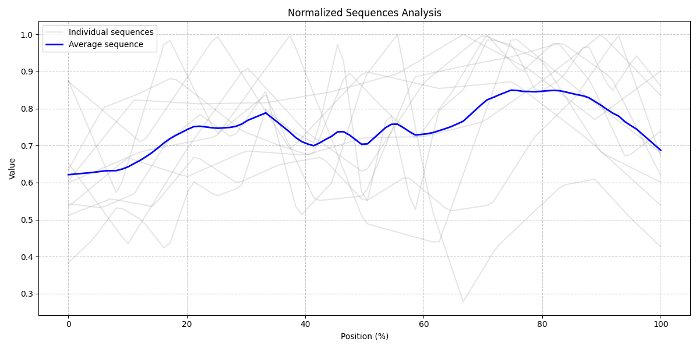

# Frames of Mind: Animating R1's Thoughts

[Daniel Healy](https://www.linkedin.com/in/daniel-healy/)

## Thought Plots

I was curious about text or embedding space patterns in R1's chains of thought, so I saved some and animated the results.

Here's what it looks like when R1 answers a question (in this case "Describe how a bicycle works."):

| |
|---------|
|  |

We can visualize the "thought process" for R1 by:

- Saving the chains of thought as text
- Converting the text to embeddings with the OpenAI API
- Plotting the embeddings sequentially with t-SNE

## Consecutive Distance

| |
|---------|
|  |

It might be useful to get a sense of how big each jump is. The graph above shows the consecutive comparison, by default cosine similarity normalized across the set of all consecutive steps to 0, 1. Euclidean distance in the t-SNE plot matches better visually but is less accurate to the fundamentals. Normalization may be a matter of preference; I'm interested in seeing when the bigger or smaller jumps happen in the "thought cycle".

## Combined Plot

| |
|---------|
|  |

The combined plot shows both at once.

## Aggregate Distances

| |
|---------|
|  |

The graph above shows the aggregate distances for 10 samples. To my eyes it looks like a "search" phase where size of step is large, followed by a stable "thinking" phase, followed by a "concluding" phase. Not conclusive at this time.

## Usage

I used these prompts:

1. Describe how a bicycle works.
2. Design a new type of transportation.
3. Explain why leaves change color in autumn
4. How should society balance individual freedom with collective good?
5. How would you resolve a conflict between two people with opposing views?
6. What makes a good life?
7. What would happen if gravity suddenly doubled?
8. What's the best way to comfort someone who is grieving
9. Why do humans make art?
10. Why do people tell jokes?

The chains are available in data/chains. To easily pull from Deepseek's public chat interface, paste the "pull_cot.js" script into your browser console when a chat is open. It will download automatically.

Install requisite packages in Pipfile and run with the function in run.py.
